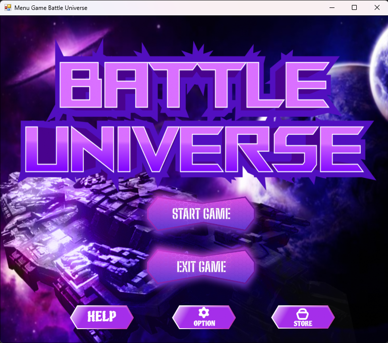
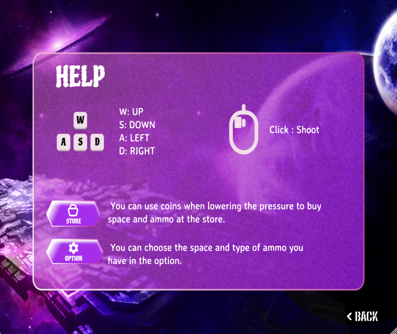
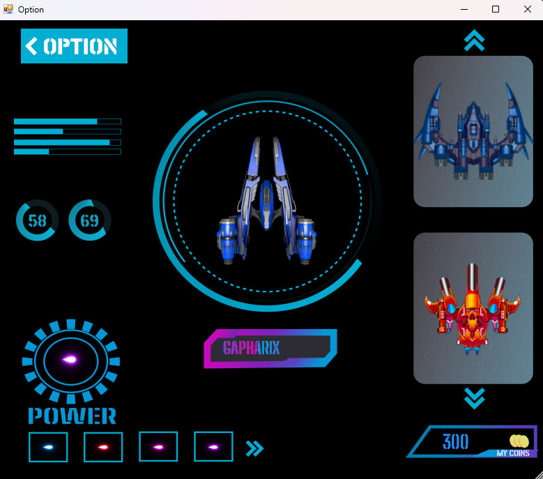
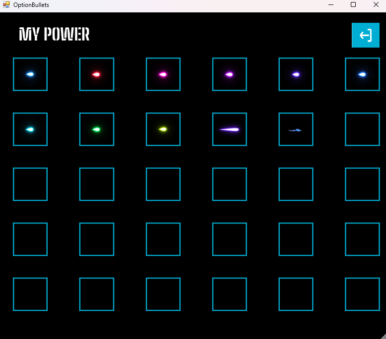
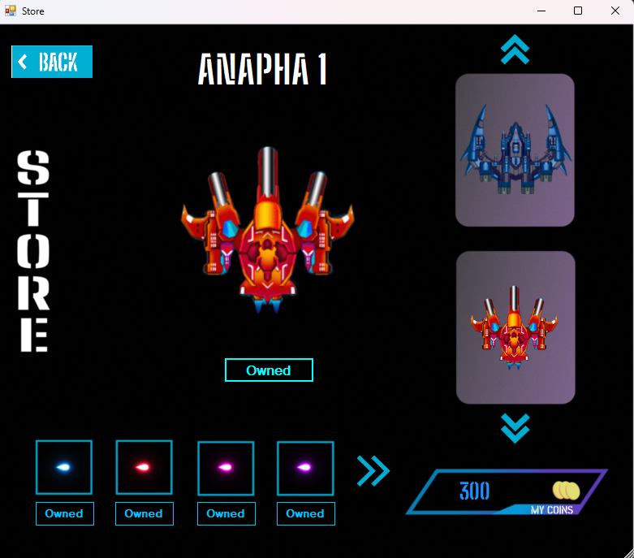
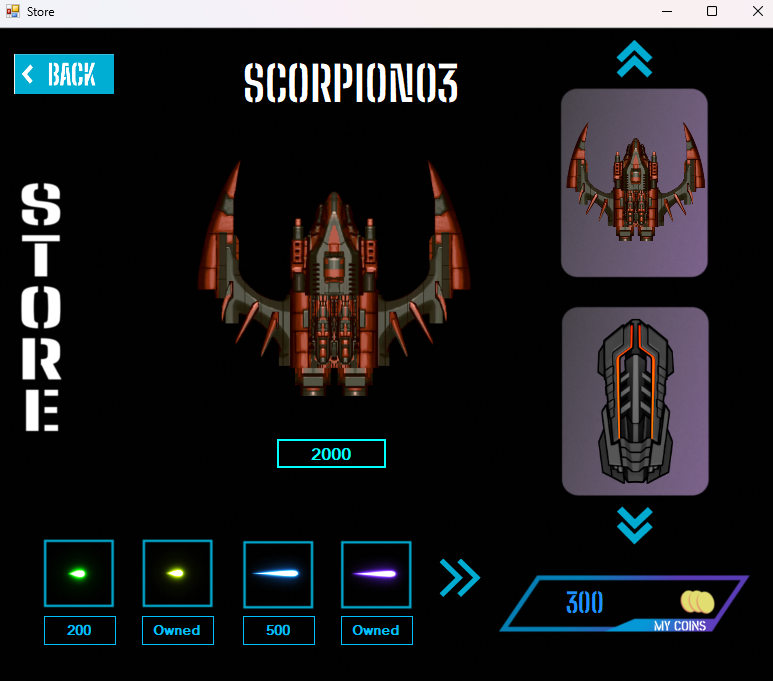
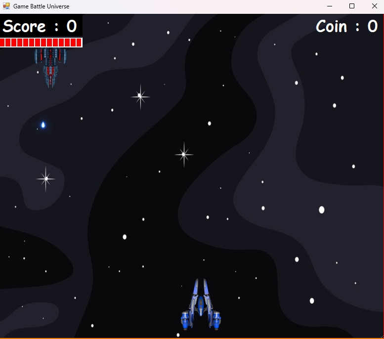
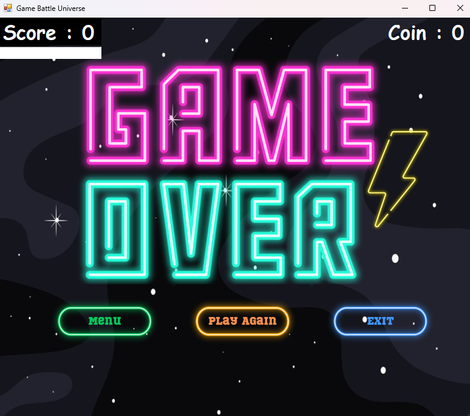

# Battle-Universe

- Đây là game đầu tiên của mình, một loại game có cơ chế chơi cơ bản.

### Hướng dẫn

- Ngôn ngữ lập trình : C#
- Công cụ hỗ trợ : Visual Studio 2022 (Windows Form Application)
- Dữ liệu lưu trữ : File INI (```bin/Debug/Data```)

### Giao diện

***

* Menu
* Help
* Option
* Bullet Option 
* Store
* Play Game

### Chức năng

***

* Điều khiển player.
* Chức năng spawn Enemy, spawn Bullet (người chơi và Enemy).
* Enemy tự động di chuyển và tấn công người chơi (cơ bản chỉ là đi qua lại và tự động bắn).
* Lưu trữ dữ liệu người chơi.
* Mua tàu vũ trụ.
* Mua loại đạn.
* Chọn đạn, chọn tàu vũ trụ tùy thích mà người chơi đã sỡ hữu.

## Demo

   |  
:---------------: | :---------------:
   |  
 | 
  